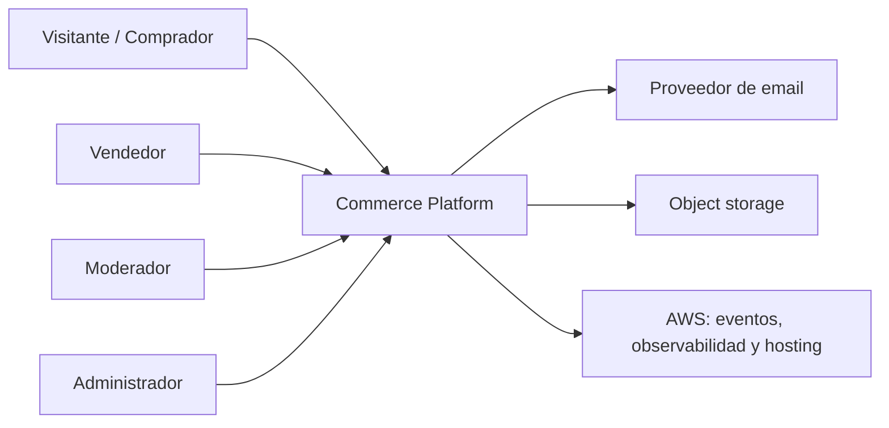
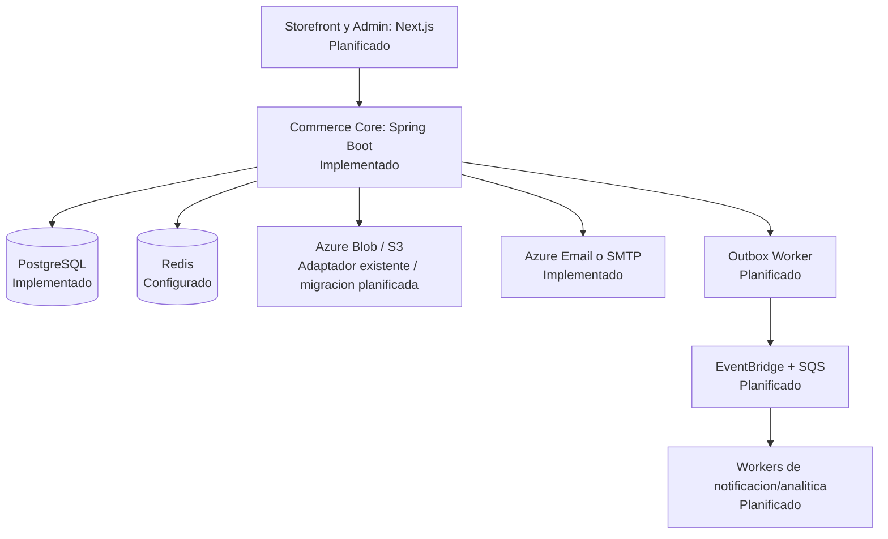
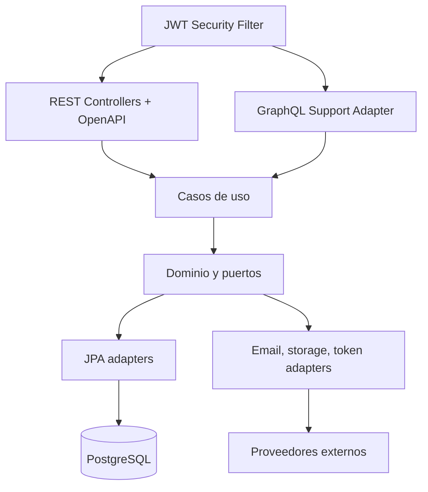

# Arquitectura C4

Este documento describe el estado objetivo de Fase 0. Los componentes cloud y el frontend son planificados, no implementados todavia.

## Nivel 1: Contexto

## Nivel 2: Contenedores

## Nivel 3: Componentes del Commerce Core

## Limites de dominio objetivo

| Contexto | Responsabilidad | Estado |
|---|---|---|
| Identity | Registro, login, refresh, revocacion y perfiles | Implementado parcialmente |
| Catalog | Productos, categorias, imagenes y publicacion | Implementado parcialmente |
| Cart | Carrito y sus lineas | Implementado como CRUD; requiere redisenio |
| Orders | Confirmacion, transiciones e historial | CRUD actual; flujo planificado |
| Inventory | Stock y reservas | Persistencia existente; flujo planificado |
| Support | Incidencias, reportes y apelaciones | Implementado parcialmente |
| Notifications | Registro y entrega asincrona | Adaptadores existentes; eventos planificados |
| Analytics | Eventos de negocio y datos de BI | Planificado |
