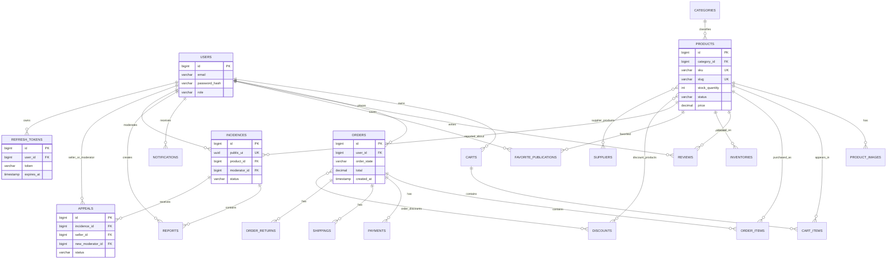

# Esquema Actual de Persistencia

Fuente de verdad: migraciones Flyway `V1` a `V6` en `src/main/resources/db/migration/`. Este diagrama describe tablas existentes, no garantiza que todos los modulos tengan un flujo de aplicacion terminado.

## Notas de evolucion

- `payments` existe por scaffolding, pero no forma parte del alcance actual.
- `products.stock_quantity` es la unica fuente de verdad para stock vendible y reservas. `inventories.available_quantity` queda fuera del checkout hasta que se modele como asignacion por bodega derivada.
- Las tablas `orders`, `payments` y `shippings` no imponen cardinalidad uno a uno por constraint; el modelo de aplicacion debe definirla o una migracion futura debe reforzarla.
- `outbox_events` y `audit_logs` se crean en `V7`. La confirmacion de pedido escribe ambos registros en la misma transaccion que el pedido y la reserva de stock.
