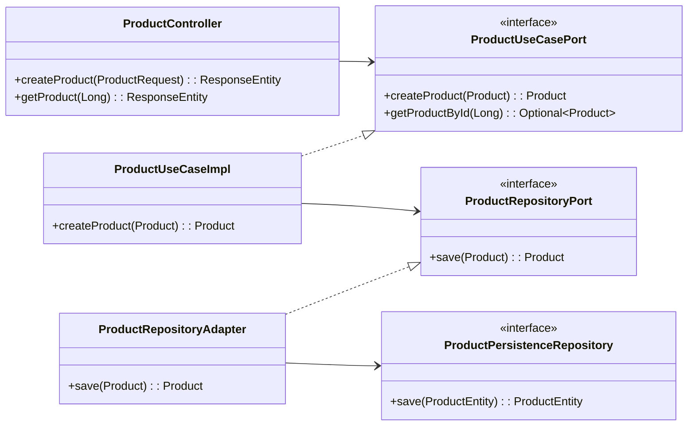
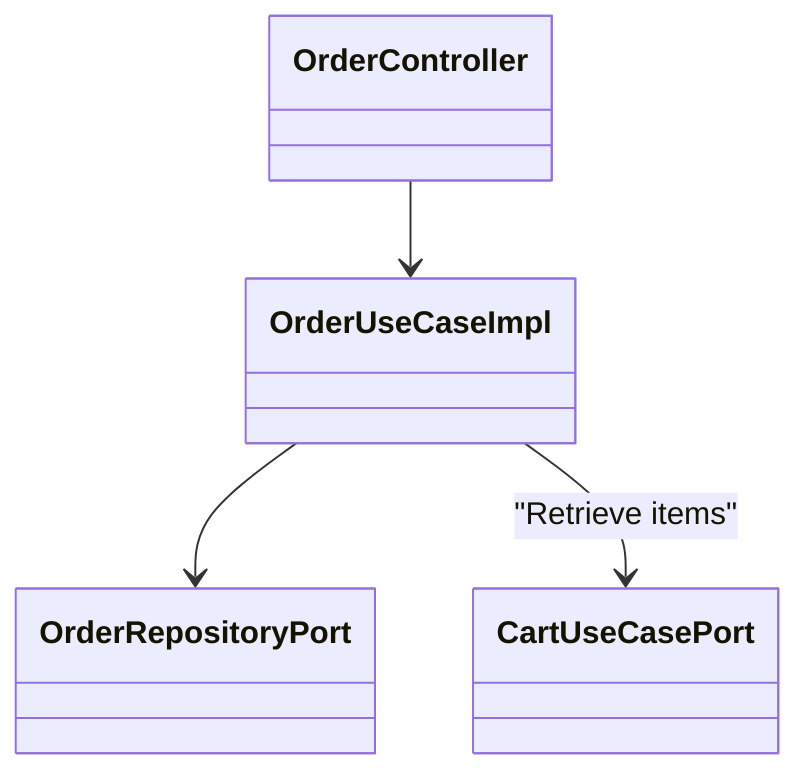

# 📘 Detailed System Specifications

This document serves as the master technical reference for the **E-commerce Backend**. It contains detailed module designs, class structure per domain, applied security measures, and a comprehensive test inventory.

---

## 1. 🌟 Detailed System Features

### **Core Commerce**
- **Product Management**:
  - Full CRUD capabilities.
  - Category association and validation.
  - Inventory management (Stock tracking).
  - Price and Rating handling (`BigDecimal` for precision).
- **Shopping Cart**:
  - Persistent cart per user.
  - Add/Remove items.
  - Auto-calculation of totals.
- **Orders**:
  - Conversion of Cart to Order.
  - Order state machine (Pending, Paid, Shipped, Cancelled).
  - History tracking.

### **User & Identity**
- **Sovereign Identity**: Custom JWT implementation (Self-contained tokens).
- **Role-Based Access**:
  - `ROLE_USER`: Standard shopping features.
  - `ROLE_ADMIN`: Back-office management (Products, Categories).
- **Profile Management**: Address and personal info updates.

### **Customer Support (Hybrid API)**
- **Incidence Reporting**: Users can open tickets for specific orders.
- **Appeals**: Logic to challenge decisions on returns/refunds.
- **Real-time capable**: Exposed via **GraphQL** for flexible data fetching.

### **Infrastructure**
- **Notifications**: Transactional emails via **Azure Communication Services**.
- **Database**: PostgreSQL with strict referential integrity.
- **Containerization**: Full Docker support for reproducible builds.

---

## 2. 🧩 Class Diagrams by Module

We follow strictly the **Hexagonal Pattern**. Below are the diagrams for the core modules showing how components interact.

### **2.1 Product Module**

### **2.2 Order Module**

*Note: All modules (Cart, User, Category) follow this exact port/adapter pattern to ensure consistency.*

---

## 3. 🔒 Applied Security

### **Authentication Strategy**
- **Mechanism**: JWT (JSON Web Token).
- **Token Location**: `Authorization: Bearer <token>` in HTTP Header.
- **Encryption**: BCrypt for passwords (cost factor 10).

### **Authorization Matrix**

| Endpoint | Method | Role Required | Description |
|----------|--------|---------------|-------------|
| `/auth/**` | POST | Public | Login and Registration |
| `/products` | GET | Public | Catalog browsing |
| `/products` | POST/PUT | **ADMIN** | Catalog management |
| `/cart/**` | ANY | **USER** | Personal cart management |
| `/orders/**` | ANY | **USER** | Personal order history |
| `/graphql` | POST | **USER** | Support ticket system |

---

## 4. 🧪 Test Inventory & Acceptance Criteria

This section explains the implemented test suite found in `src/test/java`. Each test class is designed to verify specific **Acceptance Criteria**.

### **4.1 ProductUseCaseImplTest**
*Location: `application/usecases/ProductUseCaseImplTest.java`*

| Test Case | Description | Acceptance Criteria |
|-----------|-------------|---------------------|
| `shouldCreateProductSuccessfully` | Verifies product creation logic. | Product is saved, ID is assigned, and returned correctly. |
| `shouldGetProductByIdSuccessfully` | Fetching an existing product. | Returns `Optional<Product>` with correct data. |
| `shouldReturnEmptyWhenProductNotFound` | Handling non-existent IDs. | Returns `Optional.empty()` instead of null or exception. |
| `shouldUpdateProductSuccessfully` | Full update of product fields. | Name, price, and description are updated; ID remains verified. |
| `shouldHandleProductWithNoRating` | Creating a product with 0 rating. | Default rating of 0.0 is handled without error. |
| `shouldDeleteProductSuccessfully` | Removing a product. | Repository delete method is called exactly once. |

### **4.2 SecurityIntegrationTest**
*Location: `infrastructure/security/SecurityIntegrationTest.java`*

| Test Case | Description | Acceptance Criteria |
|-----------|-------------|---------------------|
| `accessPublicEndpoint_Success` | Accessing `/products` without token. | Returns `200 OK`. |
| `accessProtectedEndpoint_Unauthorized` | Accessing `/orders` without token. | Returns `401 Unauthorized` (not 403 or 500). |
| `accessAdminEndpoint_Forbidden` | User accessing `/admin` resource. | Returns `403 Forbidden`. |

### **4.3 Email Infrastructure**
*Location: `infrastructure/email/`*

These tests verify the Azure integration (using Mocks primarily to avoid cost/spam).
- **Template Rendering**: Verifies that HTML templates load correctly.
- **Async Sending**: Verifies that email sending does not block the main usage thread.

---

## 5. 📂 Project Structure Reference

For quick navigation during development:

- `src/main/java/.../core/model` -> **Where the Data definitions live**.
- `src/main/java/.../adapters/in/rest` -> **Where the API Endpoints live**.
- `src/main/java/.../adapters/out/persistence` -> **Where the Database Logic lives**.
- `src/test/java` -> **Where you verify your changes**.

