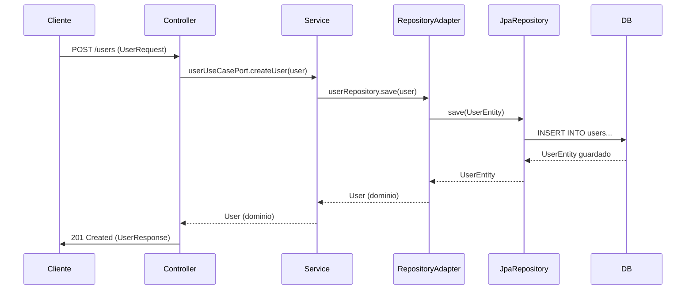

Entiendo, vamos a simplificar y clarificar el flujo **usando arquitectura hexagonal con Spring**, paso a paso, con un ejemplo concreto de creación de usuario:

---

### 🌐 **Componentes Clave en Arquitectura Hexagonal + Spring**
| Capa              | Componente           | Responsabilidad                                  | Ejemplo Spring           |
|--------------------|----------------------|-------------------------------------------------|--------------------------|
| **Core**          | Model                | Entidades de negocio (sin anotaciones de Spring)| `User.java`              |
|                   | Ports (Interfaces)   | Contratos de entrada/salida                     | `UserRepository.java`    |
|                   | Use Cases            | Lógica de negocio pura                          | `UserService.java`       |
| **Adapters**      | Controllers          | Manejo HTTP, entrada/salida API                 | `UserController.java`    |
|                   | Persistence Adapters | Implementación de repositorios (JPA, etc.)      | `UserRepositoryAdapter.java` |
|                   | Mappers              | Conversión entre objetos                        | `UserMapper.java`        |
| **Infra**         | Config               | Configuración de Spring                         | `AppConfig.java`         |

---

### 🔄 **Flujo de Creación de Usuario (Paso a Paso)**

#### 1. **Cliente hace POST a `/api/users`**
```json
{
   "name": "Ana",
   "email": "ana@example.com",
   "password": "Pass1234"
}
```

#### 2. **Controller (Adapter de Entrada)**
```java
@RestController
public class UserController {

   private final UserService userUseCasePort; // Use Case del Core
   private final UserMapper userMapper;   // Mapper a DTOs

   @PostMapping("/users")
   public ResponseEntity<UserResponse> createUser(@Valid @RequestBody UserRequest request) {
      // Convierte DTO a Modelo de Dominio
      User user = userMapper.toDomain(request);

      // Ejecuta Caso de Uso
      User createdUser = userUseCasePort.createUser(user);

      // Convierte a DTO de Respuesta
      UserResponse response = userMapper.toResponse(createdUser);

      return ResponseEntity.created(URI.create("/users/" + createdUser.getId()))
              .body(response);
   }
}
```

#### 3. **UserService (Core - Use Case)**
```java
@Service // Opcional, puede ser POJO
public class UserService {

   private final UserRepository userRepository; // Puerto del Core

   public User createUser(User user) {
      // Validación de negocio (Core)
      if (user.getPassword().length() < 8) {
         throw new InvalidUserException("Password too short");
      }

      // Persistencia (llama al adaptador)
      return userRepository.save(user);
   }
}
```

#### 4. **UserRepositoryAdapter (Adapter de Persistencia)**
```java
@Component
public class UserRepositoryAdapter implements UserRepository {

   private final UserJpaRepository jpaRepository; // Spring Data JPA
   private final UserPersistenceMapper mapper;

   @Override
   public User save(User user) {
      // Convierte Modelo de Dominio a Entidad JPA
      UserEntity entity = mapper.toEntity(user);

      // Persiste usando JPA
      UserEntity savedEntity = jpaRepository.save(entity);

      // Convierte de vuelta a Dominio
      return mapper.toDomain(savedEntity);
   }
}
```

#### 5. **UserJpaRepository (Spring Data JPA)**
```java
@Repository
public interface UserJpaRepository extends JpaRepository<UserEntity, Long> {
   // Métodos automáticos de Spring Data
   boolean existsByEmail(String email);
}
```

#### 6. **Base de Datos**
- Se crea el registro en la tabla `users` (mapeado por `UserEntity`)

---

### 🗺️ **Diagrama de Flujo**


---

### 🔧 **Configuración Esencial**
1. **Habilitar Escaneo** (Clase principal):
```java
@SpringBootApplication
@EnableJpaRepositories(basePackages = "com.tuapp.adapters.persistence")
@EntityScan(basePackages = "com.tuapp.adapters.persistence")
@ComponentScan(basePackages = {"com.tuapp.core", "com.tuapp.adapters"})
public class Application {
   public static void main(String[] args) {
      SpringApplication.run(Application.class, args);
   }
}
```

2. **application.properties**:
```properties
# Habilita DDL automático (solo para desarrollo)
spring.jpa.hibernate.ddl-auto=update
spring.datasource.url=jdbc:postgresql://localhost:5432/mydb
spring.datasource.username=user
spring.datasource.password=pass
```

---

### ✅ **Reglas Clave para Mantener Arquitectura Hexagonal**
1. **Core no depende de Spring**:
   - Las entidades y casos de uso son POJOs.
   - Las interfaces (puertos) están en `core/ports`.

2. **Adapters implementan los puertos**:
   - Los controladores y repositorios son "adaptadores" de tecnología.

3. **DTOs solo en adapters**:
   - El core nunca ve DTOs, solo modelos de dominio.

4. **Excepciones controladas**:
   - Mapeo de excepciones de infraestructura a errores HTTP.

---

### 🛠️ **Ejemplo de Mapper (MapStruct)**
```java
@Mapper(componentModel = "spring")
public interface UserMapper {
   // Request → Dominio
   User toDomain(UserRequest request);

   // Dominio → Response
   UserResponse toResponse(User user);

   // Dominio → Entidad JPA (en otro mapper)
   UserEntity toEntity(User user);
}
```

---

### 🚨 **Manejo de Errores (Ejemplo)**
```java
@ControllerAdvice
public class GlobalExceptionHandler {

   @ExceptionHandler(InvalidUserException.class)
   public ResponseEntity<ErrorDTO> handleInvalidUser(InvalidUserException ex) {
      ErrorDTO error = new ErrorDTO("INVALID_USER", ex.getMessage());
      return ResponseEntity.badRequest().body(error);
   }
}
```

---

**Conclusión**: En arquitectura hexagonal con Spring:
- **Core**: Lógica de negocio pura (sin Spring).
- **Adapters**: Implementan puertos usando Spring (controllers, JPA).
- **Flujo**: Cliente → Controller (DTO → Dominio) → Service → RepositoryAdapter → JPA → DB.

¿Quieres que profundicemos en cómo implementar un módulo específico (ej: autenticación) bajo esta estructura? 😊


