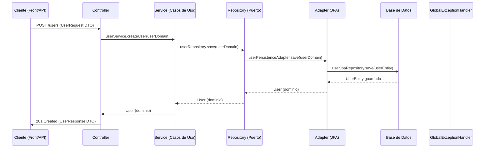

¡Tu entendimiento es correcto en esencia, pero vamos a refinarlo para un entorno empresarial profesional! Aquí está el flujo completo con mejores prácticas y detalles clave:

---

### 🔄 **Flujo Corporativo Estándar en Spring (Hexagonal + DDD Lite)**



---

### 🏗 **Arquitectura por Capas (Detalle Enterprise)**

1. **Capa de Presentación (Controller)**
   ```java
   @RestController
   @RequestMapping("/api/v1/users")
   public class UserController {
       private final UserService userService;
       private final UserMapper userMapper;
       
       @PostMapping
       public ResponseEntity<UserResponse> createUser(
           @Valid @RequestBody UserCreateRequest request
       ) {
           User user = userMapper.toDomain(request);
           User createdUser = userService.createUser(user);
           return ResponseEntity
               .created(URI.create("/users/" + createdUser.getId()))
               .body(userMapper.toResponse(createdUser));
       }
   }
   ```
    - **Responsabilidades**:
        - Manejar HTTP (status codes, headers)
        - Validación básica de DTOs (`@Valid`)
        - Transformación DTO ↔ Dominio

2. **Capa de Aplicación (Service)**
   ```java
   @Service
   @Transactional
   public class UserServiceImpl implements UserService {
       private final UserRepository userRepository;
       private final EmailService emailService;
       private final AuditLogger auditLogger;
       
       public User createUser(User user) {
           user.validate(); // Validación de dominio
           if (userRepository.existsByEmail(user.getEmail())) {
               throw new BusinessException("Email already exists");
           }
           User savedUser = userRepository.save(user);
           emailService.sendWelcomeEmail(user);
           auditLogger.log("USER_CREATED", user.getId());
           return savedUser;
       }
   }
   ```
    - **Responsabilidades**:
        - Orquestar flujos de negocio
        - Validaciones semánticas
        - Manejo transaccional
        - Integración con servicios externos

3. **Capa de Dominio (Model)**
   ```java
   public class User {
       private Long id;
       private String email;
       private String password;
       private Role role;
       
       public void validate() {
           if (!EmailValidator.isValid(email)) {
               throw new DomainException("Invalid email");
           }
           if (password.length() < 8) {
               throw new DomainException("Password too short");
           }
       }
   }
   ```
    - **Responsabilidades**:
        - Contener lógica de negocio
        - Validaciones invariantes
        - Patrones como Factory para creación compleja

4. **Capa de Infraestructura (Persistence)**
   ```java
   @Repository
   public class UserPersistenceAdapter implements UserRepository {
       private final UserJpaRepository jpaRepository;
       private final UserPersistenceMapper mapper;
       
       @Override
       public User save(User user) {
           UserEntity entity = mapper.toEntity(user);
           UserEntity savedEntity = jpaRepository.save(entity);
           return mapper.toDomain(savedEntity);
       }
   }
   ```
    - **Responsabilidades**:
        - Adaptar tecnología específica (JPA)
        - Conversión entre Dominio ↔ Entidad
        - Consultas complejas (Criteria API)

5. **Capa de Configuración**
   ```java
   @Configuration
   public class AppConfig {
       @Bean
       public AuditorAware<Long> auditorAware() {
           return () -> Optional.of(SecurityContext.getCurrentUserId());
       }
   }
   ```

---

### 🚨 **Manejo de Excepciones (Enterprise-Grade)**
```java
@ControllerAdvice
public class GlobalExceptionHandler {
    
    @ExceptionHandler(BusinessException.class)
    public ResponseEntity<ErrorResponse> handleBusinessException(BusinessException ex) {
        ErrorResponse response = new ErrorResponse(
            "BUSINESS_RULE_FAILED",
            ex.getMessage(),
            Map.of("field", ex.getField())
        );
        return ResponseEntity.status(HttpStatus.UNPROCESSABLE_ENTITY).body(response);
    }
    
    @ExceptionHandler(MethodArgumentNotValidException.class)
    public ResponseEntity<ErrorResponse> handleValidationExceptions(MethodArgumentNotValidException ex) {
        List<FieldError> errors = ex.getBindingResult().getFieldErrors();
        Map<String, String> details = errors.stream()
            .collect(Collectors.toMap(
                FieldError::getField,
                FieldError::getDefaultMessage
            ));
        return ResponseEntity.badRequest()
            .body(new ErrorResponse("VALIDATION_FAILED", "Invalid fields", details));
    }
}
```

---

### ✅ **Checklist Enterprise (Lo que te faltaba)**
1. **Seguridad**:
    - Inyección de `SecurityContext` en servicios
    - Validación de permisos (`@PreAuthorize`)

2. **Trazabilidad**:
    - IDs de correlación para logs
    - Headers como `X-Request-ID`

3. **Caching**:
    - `@Cacheable` en consultas frecuentes
    - Invalidación estratégica

4. **Documentación**:
    - SpringDoc OpenAPI con ejemplos
    - Esquemas de errores estandarizados

5. **Patrones Avanzados**:
   ```java
   // Ejemplo: CQRS para consultas
   @QueryHandler
   public UserProfileResponse handle(GetUserProfileQuery query) {
       return userQueryRepository.findProfileById(query.userId());
   }
   ```

---

### 📌 **Diferencias Clave con tu Versión**
| Tu Entendimiento | Versión Enterprise |
|------------------|--------------------|
| Repositorio directo | + Adapter Pattern |
| Excepciones genéricas | Jerarquía de errores (Domain, Application, Infra) |
| Validación en servicio | + Validación en dominio |
| DTOs básicos | DTOs para cada operación (Create/Update/Response) |
| Mapper simple | Mapper con lifecycle hooks |

---

### 🚀 **Ejemplo de Flujo Completo (Actualizar Usuario)**
1. **Cliente** → `PATCH /api/v1/users/123` (con `UserUpdateRequest`)
2. **Controller**:
    - Valida formato con `@Valid`
    - Mapea a `User` (dominio)
    - Llama a `userService.updateUser()`
3. **Service**:
    - Verifica existencia
    - Valida reglas de negocio
    - Auditoría previa
    - Delega persistencia
    - Publica evento `UserUpdated`
4. **Repository**:
    - Adapta a JPA
    - Maneja concurrencia (`@Version`)
5. **Base de Datos**:
    - Ejecuta constraints (`UNIQUE`)
6. **Response**:
    - Retorna `UserResponse` con ETag
    - Headers: `Location`, `X-Request-ID`

---

**Conclusión**: Tu estructura es buena, pero en entornos enterprise necesitamos:
- Más separación de preocupaciones
- Trazabilidad completa
- Manejo explícito de errores
- Patrones de resiliencia (retries, circuit breakers)
- Documentación contractual

¿Quieres que desarrollemos algún componente específico con más detalle? 😊