# Documentación Técnica: Modelo de Dominio

Este documento describe las entidades principales del sistema, sus atributos, tipos de datos y las relaciones existentes entre ellas.

## Diagrama de Clases (Mermaid)

```mermaid
classDiagram
    %% Estructura de Entidades
    class User {
        Long id
        String name
        String email
        String password
        String address
        String phone
        UserRole role
    }

    class Product {
        Long id
        String name
        String description
        BigDecimal price
        Integer stock
        Category category
        BigDecimal averageRating
        List~String~ images
        +validate()
    }

    class Category {
        Long id
        String name
        String description
        List~Product~ products
    }

    class Order {
        Long id
        User user
        List~Product~ products
        BigDecimal total
        OrderState orderState
        LocalDateTime createdAt
        LocalDateTime deliveredAt
        String paymentType
    }

    class Cart {
        Long id
        User user
        List~Product~ products
    }

    class Review {
        Long id
        User user
        Product product
        Integer rating
        String comment
        LocalDateTime createdAt
    }

    class Payment {
        Long id
        Order order
        BigDecimal amount
        PaymentStatus status
        PaymentMethod method
        LocalDateTime paymentDate
    }

    class Shipping {
        Long id
        Order order
        String deliveryAddress
        ShippingStatus status
        String carrier
        String trackingNumber
        LocalDateTime estimatedDelivery
    }

    class Discount {
        Long id
        String code
        DiscountType type
        BigDecimal value
        List~Product~ applicableProducts
        LocalDateTime expirationDate
    }

    class Favorite {
        Long id
        User user
        Product product
        LocalDateTime createdAt
    }

    class Return {
        Long id
        User user
        Order order
        String reason
        ReturnStatus status
        LocalDateTime requestedAt
    }

    class Incidence {
        Long id
        UUID publicUi
        Product product
        IncidenceStatus status
        LocalDateTime createdAt
        Boolean autoclosed
        User moderator
        String moderatorComment
        IncidenceDecision decision
        List~Report~ reports
    }

    class Appeal {
        Long id
        Incidence incidence
        User seller
        String reason
        LocalDateTime createdAt
        AppealStatus status
        User newModerator
        AppealDecision finalDecision
        LocalDateTime finalDecisionAt
    }

    class Report {
        Long id
        User reporter
        String reason
        String comment
        LocalDateTime createdAt
        ReportSource source
    }

    class Inventory {
        Long id
        Product product
        Integer availableQuantity
        String warehouseLocation
    }

    class Supplier {
        Long id
        String name
        String contact
        List~Product~ suppliedProducts
    }

    class Notification {
        Long id
        User user
        String message
        NotificationType type
        NotificationStatus status
        LocalDateTime createdAt
    }

    %% Enumeraciones (Enums)
    class UserRole {
        <<enumeration>>
        USER
        ADMIN
        MODERATOR
    }

    class OrderState {
        <<enumeration>>
        PENDING
        SENT
        DELIVERED
        CANCELED
    }

    class PaymentStatus {
        <<enumeration>>
        PENDING
        COMPLETED
        FAILED
        REFUNDED
    }

    class ShippingStatus {
        <<enumeration>>
        PREPARING
        SHIPPED
        DELIVERED
        RETURNED
        FAILED
    }

    class IncidenceStatus {
        <<enumeration>>
        OPEN
        PENDING_REVIEW
        DECIDED
        CLOSED
        APPEALED
    }

    class ReturnStatus {
        <<enumeration>>
        PENDING
        APPROVED
        REJECTED
    }

    %% Relaciones y Multiplicidad
    User "1" *-- "1" UserRole : has
    Product "n" o-- "1" Category : belongs to
    Category "1" *-- "n" Product : contains
    Order "n" --> "1" User : placed by
    Order "n" *-- "n" Product : includes
    Order "1" *-- "1" OrderState : current
    Cart "1" -- "1" User : owned by
    Cart "1" *-- "n" Product : contains
    Review "n" --> "1" User : written by
    Review "n" --> "1" Product : evaluates
    Payment "1" -- "1" Order : pays for
    Payment "*" -- "1" PaymentStatus : state
    Shipping "1" -- "1" Order : delivers
    Shipping "*" -- "1" ShippingStatus : state
    Favorite "n" --> "1" User : saved by
    Favorite "n" --> "1" Product : references
    Return "n" --> "1" User : requested by
    Return "1" -- "1" Order : refers to
    Return "*" -- "1" ReturnStatus : state
    Incidence "n" --> "1" Product : about
    Incidence "*" -- "1" IncidenceStatus : state
    Incidence "n" --> "0..1" User : moderated by
    Incidence "1" *-- "n" Report : composed of
    Appeal "1" -- "1" Incidence : challenges
    Appeal "n" --> "1" User : seller (appellant)
    Appeal "n" --> "0..1" User : new moderator
    Report "n" --> "1" User : reported by
    Inventory "1" -- "1" Product : tracks
    Supplier "1" *-- "n" Product : supplies
    Notification "n" --> "1" User : for
```

## Descripción de las Relaciones

### Usuarios y Roles
Cada `User` tiene un único `UserRole` que define sus permisos en el sistema (USER, ADMIN, MODERATOR).

### Ciclo de Compra
- Un **Usuario** puede tener un único **Carrito** (`Cart`) activo con múltiples **Productos**.
- Al realizar una compra, se genera una **Orden** (`Order`) que registra la lista de productos, el total y el estado actual (`OrderState`).
- Cada orden está vinculada a un **Pago** (`Payment`) y a un **Envío** (`Shipping`).

### Catálogo e Inventario
- Los **Productos** pertenecen a una **Categoría**.
- El **Inventario** (`Inventory`) realiza el seguimiento de la cantidad disponible y la ubicación en almacén de cada producto.
- Los **Proveedores** (`Supplier`) pueden suministrar múltiples productos.

### Interacción de Usuario
- Los usuarios pueden dejar **Reseñas** (`Review`) sobre productos, calificándolos y comentando.
- Los usuarios pueden marcar productos como **Favoritos** (`Favorite`).
- Los usuarios pueden solicitar una **Devolución** (`Return`) vinculada a una orden específica.

### Moderación e Incidencias
- Se pueden generar **Reportes** (`Report`) sobre contenidos o conductas.
- Los reportes se agrupan en **Incidencias** (`Incidence`) que son revisadas por un moderador.
- Si un vendedor no está de acuerdo con la decisión de una incidencia, puede presentar una **Apelación** (`Appeal`), la cual será revisada por un nuevo moderador.

### Notificaciones
El sistema genera **Notificaciones** para informar al usuario sobre cambios de estado en sus órdenes, respuestas a incidencias o promociones aplicadas.
