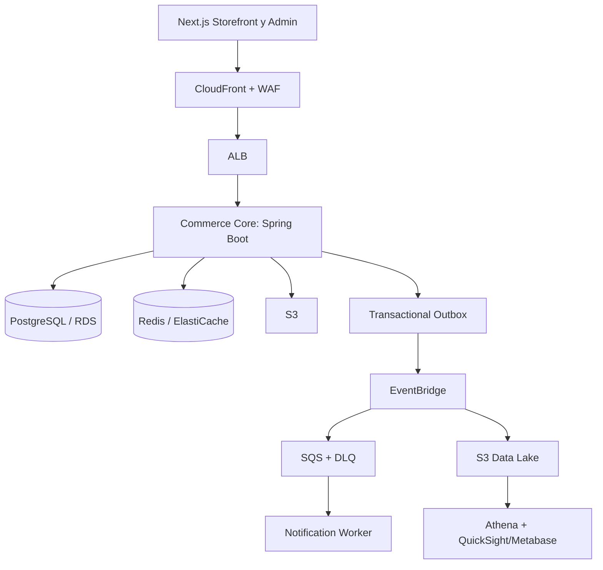

# Plan Maestro: Commerce Platform

## 1. Objetivo de Portafolio

Construir una plataforma B2C de comercio con back-office, inventario, soporte y analitica. El proyecto debe demostrar decisiones de ingenieria justificadas: un dominio consistente, seguridad verificable, observabilidad, despliegue reproducible con IaC y una evolucion controlada hacia componentes independientes.

No se implementaran pagos en esta etapa. El checkout terminara en un pedido `PENDING_CONFIRMATION`; la integracion con un PSP sera una fase posterior, aislada por un puerto de aplicacion para no contaminar el dominio.

## 2. Estado Inicial

- Backend: Java 21, Spring Boot 3.4, Gradle y arquitectura hexagonal.
- Dominio existente: usuarios, catalogo, carrito, pedidos, inventario, favoritos, soporte, devoluciones, envios y notificaciones.
- Datos: PostgreSQL, Flyway y Redis configurado.
- Integraciones actuales: Azure Email y Azure Blob mediante adaptadores.
- APIs: REST/OpenAPI y GraphQL para incidencias y apelaciones.
- Calidad existente: pruebas unitarias, de controlador e integracion con H2.
- Documentacion revisada: `Docs/`. `docs-pdf-planification/` existe pero esta vacio al momento de redactar este plan.

## 3. Decisiones Arquitectonicas

### Monolito modular primero

El backend continuara como un monolito modular con limites explicitos entre `identity`, `catalog`, `cart`, `orders`, `inventory`, `support`, `notifications` y `analytics`. Cada modulo tendra casos de uso, puertos y adaptadores propios. No se extraeran microservicios hasta que exista una razon operacional: escalado independiente, ownership de datos, tecnologia especializada o aislamiento de fallos.

### Eventos confiables sin infraestructura pesada local

Se implementara el patron Transactional Outbox en PostgreSQL. La misma transaccion que modifica el agregado guarda un evento en `outbox_events`; un worker lo publica y marca como procesado de forma idempotente.

| Entorno | Transporte | Objetivo |
|---|---|---|
| Local | PostgreSQL Outbox + worker Spring Boot | Desarrollo y pruebas sin brokers adicionales |
| AWS dev/prod | Outbox -> EventBridge -> SQS | Entrega desacoplada, reintentos y DLQ |

El dominio publica eventos mediante un puerto, no conoce SQS ni EventBridge. Esto permite verificar la logica localmente con PostgreSQL real y cambiar solo el adaptador de infraestructura al desplegar.

### Microservicios posteriores

1. `notification-worker`: primer candidato; consume eventos de pedido, inventario y soporte.
2. `search-indexer`: solo cuando PostgreSQL full-text deje de cubrir catalogo y filtros.
3. `ai-service`: FastAPI/Python unicamente si se necesitan embeddings, ranking o pipelines ML reales.

NestJS no se agregara sin una frontera clara. Spring Boot mantiene coherencia para el core; TypeScript se utilizara en el frontend. La diversidad tecnologica debe resolver un problema concreto, no decorar la arquitectura.

## 4. Arquitectura Objetivo

## 5. Roadmap Priorizado

### Fase 0: Base y decisiones (1 semana)

- Definir actores, flujos y criterios de aceptacion: comprador, administrador, soporte y proveedor.
- Crear ADRs: monolito modular, autenticacion, outbox, consistencia de inventario, nube AWS e IaC.
- Actualizar diagramas C4, ERD real, limites de cada modulo y contratos OpenAPI.
- Acordar SLOs iniciales: p95 de catalogo menor de 300 ms, p95 de escritura menor de 800 ms y errores 5xx menores de 0.5%.

### Fase 1: Endurecer el core (2 semanas)

- Auditar autorizacion por recurso, transacciones, errores, validacion y concurrencia de inventario.
- Corregir configuracion local de Redis: el host debe ser `redis`, no `db`.
- Sustituir H2 en integracion critica por Testcontainers con PostgreSQL y Redis.
- Incorporar auditoria: actor, accion, recurso, resultado, `traceId`, IP minimizada y timestamp UTC. No guardar secretos, tokens ni datos sensibles innecesarios.
- Establecer idempotencia para crear pedidos, reintentar operaciones y consumir eventos.

### Fase 2: Operacion de comercio sin pagos (2-3 semanas)

- Implementar reserva y liberacion de stock con expiracion y control de concurrencia.
- Formalizar maquina de estados de pedido: `DRAFT`, `PENDING_CONFIRMATION`, `CONFIRMED`, `FULFILLED`, `CANCELLED`.
- Completar envios, devoluciones, descuentos y notificaciones asincronas.
- Implementar Outbox, reintentos, deduplicacion, metricas y una cola de fallos visible para administracion.
- Mantener cualquier futuro pago detras de `PaymentPort`; no crear integracion ni persistir datos de tarjetas en esta fase.

### Fase 3: Frontend de nivel producto (2-3 semanas)

- Crear monorepo con `apps/storefront`, `apps/admin` y paquetes compartidos de UI, contratos y configuracion.
- Stack: Next.js, TypeScript, Tailwind, shadcn/ui, TanStack Query, React Hook Form y Zod.
- Storefront: catalogo, busqueda, filtros, producto, carrito, pedido y cuenta.
- Admin: productos, inventario, pedidos, soporte, auditoria y metricas operativas.
- Cumplir WCAG 2.2 AA, diseno responsive y estados de carga, vacio y error.

### Fase 4: Observabilidad, rendimiento y QA (continua; hito de 2 semanas)

- Instrumentar OpenTelemetry: trazas, logs JSON y metricas con `traceId` propagado desde HTTP hasta workers.
- Exponer salud, readiness y liveness sin filtrar informacion interna.
- Medir consultas con `EXPLAIN ANALYZE`; agregar indices solo con evidencia y paginacion obligatoria en listados.
- Cachear catalogo con Redis, TTL, invalidacion por evento y proteccion contra cache stampede.
- Automatizar unitarias, integracion, contratos, Playwright E2E, k6 de carga y OWASP ZAP en staging.
- Activar SAST, escaneo de dependencias, SBOM, escaneo de imagenes y secret scanning en CI.

### Fase 5: Datos, BI e IA (2 semanas)

- Emitir eventos de negocio: producto visto, busqueda, carrito actualizado, pedido creado, pedido confirmado y stock agotado.
- Exportar eventos a S3 en Parquet, particionados por fecha y tipo de evento.
- Crear dashboards de conversion, abandono, productos sin stock, tiempo de despacho y resolucion de soporte.
- Implementar recomendacion v1 explicable basada en popularidad, categoria y co-ocurrencia; sin LLM inicialmente.
- Como experimento posterior, crear un asistente RAG de solo lectura sobre FAQ y politicas. Nunca tendra permisos para modificar pedidos, inventario o datos personales.

### Fase 6: AWS e Infraestructura como Codigo (2 semanas)

- Terraform con modulos: `bootstrap`, `network`, `data`, `compute`, `edge`, `observability` y `security`.
- Ambientes aislados `dev`, `staging` y `prod`; estado remoto en S3 con locking y permisos minimos.
- Desplegar en ECS Fargate: ALB publico, servicios privados, RDS privado, ElastiCache, S3, ECR, Secrets Manager, KMS, ACM, Route 53 y WAF.
- Usar GitHub Actions con OIDC hacia AWS, sin claves AWS persistentes en GitHub.
- Aplicar migraciones de forma controlada, smoke tests posteriores y rollback de aplicacion independiente de la migracion.

## 6. Seguridad y Datos

- TLS en transito; cifrado administrado por KMS en RDS, S3, SQS, secretos y respaldos.
- Contraseñas con BCrypt calibrado o Argon2id; nunca cifrado reversible.
- Tokens y secretos exclusivamente en Secrets Manager/variables de entorno, nunca en logs, codigo o auditoria.
- RBAC y autorizacion por propiedad del recurso en cada caso de uso.
- Rate limiting, limites de payload, validacion estricta, CSP, CORS por entorno y cabeceras de seguridad.
- URLs prefirmadas para archivos, validacion de tipo y tamano, y escaneo asincrono antes de publicar contenido.
- Retencion y anonimiazacion de datos de auditoria y analitica segun proposito; recolectar el minimo necesario.

## 7. Presupuesto Local: Maximo 60%

El limite es 9.2 GiB de los 15.3 GiB fisicos. Dado el uso actual alto de RAM y swap, los perfiles Docker deben iniciarse bajo demanda y con limites explicitos.

| Perfil | Servicios | Limite objetivo |
|---|---|---|
| `core` | API, PostgreSQL, Redis | 4 GiB |
| `frontend` | `core` + Next.js | 5.5 GiB |
| `integration` | `core` + Mailpit o emulador AWS puntual | 7 GiB |
| `qa` | Testcontainers, sin stack completo | 7 GiB |

- No ejecutar Kubernetes, Kafka, OpenSearch ni LocalStack completo localmente.
- Para mensajeria local basta PostgreSQL Outbox y un worker dentro de la aplicacion.
- Si se necesita validar SQS/EventBridge, hacerlo en AWS `dev` con presupuesto y etiquetas de costo, o activar un emulador de servicio puntual y efimero.
- Docker Compose usara perfiles, `mem_limit`, limites de CPU y volumenes persistentes solo para PostgreSQL.

## 8. Definition of Done por Hito

- ADR, diagrama y contrato actualizados.
- Pruebas automatizadas relevantes en verde y sin secretos en el repositorio.
- Metricas y logs suficientes para diagnosticar errores del flujo.
- Prueba de autorizacion negativa para cada endpoint protegido.
- Presupuesto de rendimiento verificado con una prueba reproducible.
- Despliegue de staging reproducible desde Terraform y pipeline CI/CD.

## 9. Orden Inmediato de Trabajo

1. Formalizar ADRs, C4, ERD y backlog de Fase 0.
2. Auditar los modulos existentes y corregir configuracion/contratos antes de crear frontend.
3. Introducir Testcontainers, auditoria y Outbox local.
4. Construir el storefront y panel administrativo sobre contratos estables.
5. Llevar el sistema a AWS `dev` con Terraform despues de que los flujos locales sean verificables.
